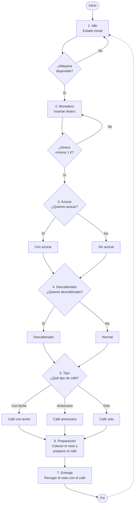

#    MAQUINA DE CAFE

## PROCESO DE LA MAQUINA

----------------------------------------------------------------------------
1 - Idle: Estado inicial, en el que comprobamos si la maquina esta disponible o no.

2 - Monedero: Insertamos el dinero que tengamos a la maquina para empecar el proceso (minimo 1 euro)

3 - Azucar: Seleccionar si queremos azucar o no

4 - Descafeinado: Seleccionar si queremos que nuestro cafe sea descafeinado

5 - Tipo: Por ultimo, seleccionamos el tipo de cafe que queramos (Con leche, americano, solo)

6 - Preparacion: Dejamos el vaso en la maquina y nos preparar automaticamente el cafe

7 - Entrega: Una vez finalizado agarramos el vaso con nuestro cafe listo para tomar

----------------------------------------------------------------------------

## Diagrama de flujo

